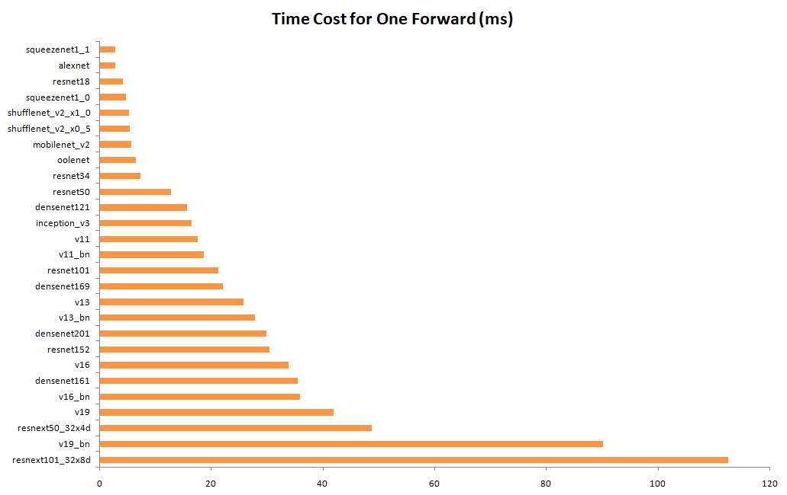
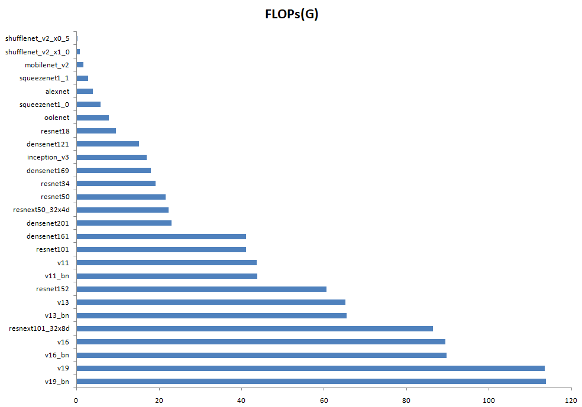

## Motivation  
To measure the computation complexity, a widely used metric is the number
of float-point operations, or FLOPs. However, FLOPs is an indirect metric according to [*ShuffleNet v2*](https://arxiv.org/abs/1807.11164). 
It is an approximation of, but usually not equivalent to the direct metric that we really care about, 
such as speed or latency.

So how to measure the computation complexity?
Two principles should be considered according to *ShuffleNet v2*.  
* The direct metric (e.g., speed) should be used instead of the indirect ones (e.g., FLOPs)
* Such metric should be evaluated on the target platform.

## Platform
* NVIDIA GeForce GTX 1080Ti
* CUDA 10.0
* CUDNN 7.5
* Intel Core i7-7700K

## Comparison

## References
[ShuffleNet V2: Practical Guidelines for Efficient CNN Architecture Design](https://arxiv.org/abs/1807.11164)   
[THOP: PyTorch-OpCounter](https://github.com/Lyken17/pytorch-OpCounter)

